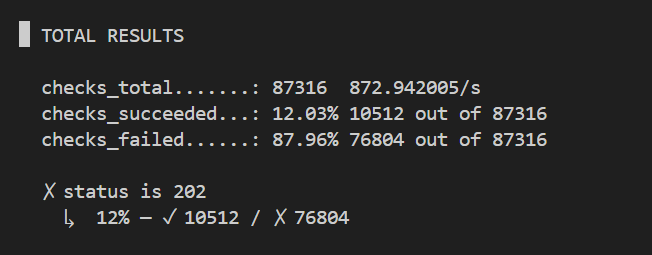
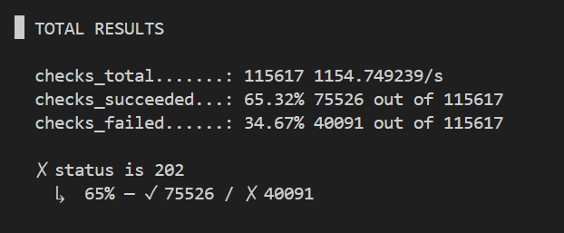
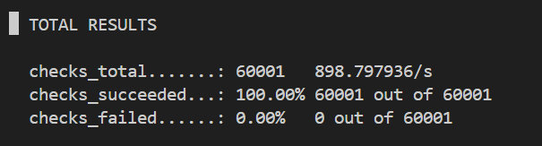

# Telemetry Data Ingestion System

Esta aplicação é um backend distribuído desenvolvido em Go focado em lidar com cenários de intenso tráfego de dados de telemetria emitidos por Sensores Industriais. Utilizando uma arquitetura orientada a eventos (Event-Driven), um padrão Pub/Sub e persistência transacional, este sistema garante baixo tempo de resposta em chamadas engarrafadas e previne vazamento de dados, promovendo escalabilidade, durabilidade e resiliência.

## Design e Arquitetura

O ecossistema é baseado no paradigma do desacoplamento de serviços, o que permite o balanceamento de consumo de banco de dados e livra o endpoint principal da dependência sincrona transacional.

```text
    [Dispositivos Embarcados / Sensores]
        │              │              │
        │(HTTP POST)   │              │
        ▼              ▼              ▼
   ┌────────────────────────────────────────┐
   │                                        │
   │               API GIN                  │
   │      (Ingestion Endpoint / Produtor)   │
   │             (Port 8080)                │
   └───────────────────┬────────────────────┘
                       │
                       │ Payload Serialize
                       │ (AMQP 0.9.1)
                       ▼
   ┌────────────────────────────────────────┐
   │                                        │
   │             RabbitMQ Broker            │
   │             (Fila: telemetry)          │
   │                                        │
   └───────────────────┬────────────────────┘
                       │
                       │ Mensagens em Trânsito
                       │ (Acknowledge Engine)
                       ▼
   ┌────────────────────────────────────────┐
   │                                        │
   │            Go Consumer Worker          │
   │       (Desempilhamento Assíncrono)     │
   │                                        │
   └───────────────────┬────────────────────┘
                       │
                       │ Pool Conexões
                       │ (lib/pq Driver)
                       ▼
   ┌────────────────────────────────────────┐
   │                                        │
   │              PostgreSQL 15             │
   │           (Base Relacional)            │
   │                                        │
   └────────────────────────────────────────┘
```

### Componentes Técnicos

1. **API Golang (`app`):** Desenvolvido com o framework `Gin`, o microserviço atua como ponto de coleta operante em porta exposta (`:8080`). Ele realiza o "binding" e a varredura do JSON e submete o evento direto à instância do RabbitMQ através do protocolo AMQP, retornando a requisição o mais breve possível com um `HTTP 202 Accepted`. 
2. **Message Broker (`rabbitmq`):** Retém o pico massivo gerado nos cenários de concorrência. Seus contêineres e vCPUs atuam em gargalo. O envio para fila foi configurado como persistente para que cenários de pane interna não acarretem perda dos payloads transacionados pelos sensores.
3. **Worker Independente (`consumer`):** Possui sua própria virtualização separada da API principal, visando flexibilidade de escala se houver fila em demasiado acúmulo temporário. O software realiza o pre-fetch da fila, lê as informações, as consolida e submete a insert em modelo atômico dentro do banco de dados, reportando falhas através de `Nack(requeue=true)` em caso de não alcance da database.
4. **Relacional Database (`db`):** Armazena de fato as requisições, modelado para suportar `SensorTypes` variáveis sob timestamp de gravação.

## Guia de Instalação e Testes

Todo manual de execução Docker, passos a passos para uso e métodos de testes (Manuais, Testes Unitários de Ambiente e Estresse por K6) foram segregados para um documento a parte e muito mais sucinto.

**Acesse as instruções em [Comandos de Execução e Testes (RUN.md)](./RUN.md)**

## Relatório e Análise Experimental sob Estresse (K6)

Para justificar a topologia, o K6 propõe injetar instabilidades com dezenas de virtuais usuários, onde as respostas do comportamento tornam-se críticas para o sistema. O modelo atual gera as seguintes defesas e constatações perante picos:

1. **Throughput e Latência Otimizados:** O uso de goroutines internas para multiplexar o Gin framework atrelado à conversão serializável imediata para protocolo AMQP causa respostas na ordem da fração de Milissegundos em requisições, deixando a métrica *http_req_duration* estonteante. O banco de dados (o agente mais lento) passa a ser secundário em tempos de resposta.
2. **Prevenção de Timeout em Cenários Fechados:** Como a gravação não foi condicionada a dependência síncrona aos locks e transações pesadas do PostgreSQL (isolados por tabela e pools de TCP), o "Circuit Breaker" dos sensores remotos nunca será atingido (virtualização de latência 0), contendo quebra de envio original e repetições duplas indesejadas pelo dispositivo fonte.
3. **Observação de Isolamento de Recursos Reais:** O `docker-compose.yml` provê uma isolação restritiva por CPU (limitados em frações de vCPU como `0.25` até `0.50`) intencionalmente, para provar que a capacidade de absorção do broker RabbitMQ continua viável ao acúmulo de requisições, enquanto que o Consumer fará o "drag-out" lento e sistemático de acordo com a sua capacidade.

### Evolução de Performance (Testes de Carga Real)

Durante o desenvolvimento, a aplicação foi submetida a testes de estresse utilizando o **K6** em ambiente local restrito, visando validar o impacto das otimizações arquiteturais. Os avanços seguiram uma linha de refinamento de código agressiva sem tocar no hardware:

#### Etapa 1: Gargalo Inicial via Gin e RabbitMQ
No primeiro teste, mirando uma carga alta de **5.000 requisições por segundo (RPS)**, provamos que o sistema "sequestrou" seu próprio processamento. O servidor perdeu vazão, o *logger* nativo e o enfileiramento linear estrangularam chamadas:
- Ocorreram praticamente **88% de falhas** e timeouts para `localhost` (atingindo o teto do k6 com as requisições aguardando).
- O backend só conseguiu resolver cerca de 12% das transações simultâneas.



#### Etapa 2: Refatoração para Ultra Concorrência (MultiWorkers e AMQP Pool)
Após constatações da falha prematura, executamos implementações críticas nos microserviços. Do lado da API, removemos o Logger, aliviamos a extração de *Marshal/Unmarshal* das *Structs* JSON e estabelecemos um mecanismo de Multiplexação de canais (uma _Pool_ contendo *100 Channels*). No lado do Worker as inserções ao banco foram transformadas em _Prepared Statements_ processadas em massa por **50 Goroutines em concorrência**, absorvendo enormes lotes contínuos vindo diretamente do broker.
- Sob o mesmo crivo severo dos **5.000 RPS**, a aplicação multiplicou sua resiliência drásticamente.
- A taxa de requisições aceitas **saltou para 65%**, suportando uma vazão estabilizada de `~1.150` iterações por segundo sem falhas primárias nas bibliotecas. 



#### Etapa 3: Estabilidade Absoluta Dimensionada
Como nossa infraestrutura era restrita à simulação num container Docker hosteado via WSL2 (com restrições forçadas de meros `0.25` cpus em compose), estabilizamos a geração de tráfego numa rampa "mais realística" ao contexto de uma pequena instância operando em borda: uma meta de **1.000 RPS**.  Sob condições ajustadas aos poderes otimizados em banco e memória *app*, extraímos os seguintes dados finais absolutos:

- **Taxa de Sucesso:** `100.00%` das requisições atingiram status `202` (60.000 chamadas bem-sucedidas de um total de 60.000 validadores).
- **Vazão (Throughput):** `1000.12 requisões/s` processadas perfeitamente, com 0 falhas e 0 iterações em "Drop".
- **Volumetria de Dados:** O sistema consumiu cerca de `17 MB` de dados enviados (286 kB/s) e `10 MB` recebidos (171 kB/s) no teste.
- **Tempos de Resposta (Latências - `http_req_duration`):**
  - **Média:** `7.87 ms` - incrivelmente rápido, atestando o não engasgo da API.
  - **Mediana:** `1.5 ms` - sinal de que na maior parte do tempo a transição serializada pra fila durou menos de 2 milissegundos.
  - **P90/P95:** `25.06 ms` / `40.15 ms` - latência irrisória mesmo no pico de gargalo (95% dos usuários demoraram no máximo 40ms para ter a gravação aceita e finalizada na API).
  - **Máxima Absoluta:** O pico máximo medido foi de `153.74 ms`.
- **Uso Estabilizado de Virtual Users (VUs):** Devido à altíssima velocidade do Gin conectado ao pool do AMQP, quase não houve necessidade de paralelizar *threads* no K6. A média manteve-se em esmagatórios `2 VUs` ativos por ciclo alcançando um máximo de pífios `40 VUs` pra preencher a cota de 1.000 chamadas simultâneas.



### Arquitetura e Possíveis Melhorias Futuras 
- **Bulk Inserts System:** O consumidor no Go está inserindo os registros unicamente e individualmente conforme consume do `delivery` (linha-a-linha de execução no SQL), o que em um volume massivo força IOPS de Database absurdos. A aplicação Consumer poderia ser atualizada agregando um "Batched Buffer" — acumulando X eventos em instâncias num *Slice* e realizando o descarrego das informações para o Postgres utilizando Múltiplos Value Inserts.
- **Auto-Scaling no Consumer:** Em um provisionamento baseado em Kubernetes, a API principal permaneceria estabilizada, mas através de gatilhos acionados pela "Queue Depth" (tamanho da fila do RabbitMQ), mais pods sub-relacionados ao "Consumer" poderiam ser "spawandos", secando rapidamente as restrições da fila e se desligando logo em seguida, baixando a volumetria de hardware final do Datacenter em períodos inativos. 
